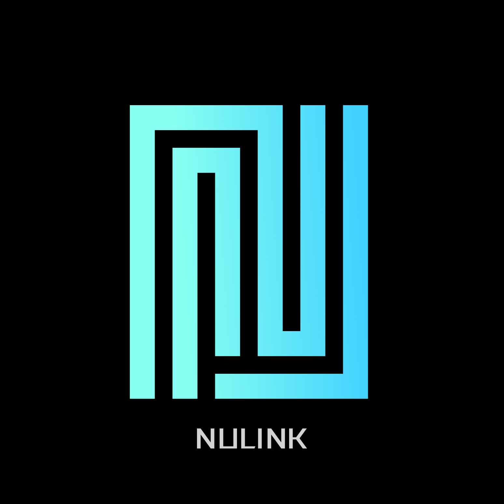

# nulink

  

  
  
  

NuLink provides privacy-preserving technology for decentralized applications via APIs. We enable and make it easy for developers, startups, small businesses and enterprises to build their own applications with all the best security and privacy practices

NuLink network is a decentralized solution for privacy-preserving applications developers to implement best practices and best of breed security and privacy. The NuLink platform provides endpoint encryption and cryptographic access control. Sensitive user data can be securely shared from any user platform to cloud or decentralized storage and access to that data is granted automatically by policy in Proxy Re-Encryption or Attribute-Based Encryption. For the data user on the other side, Zero-Knowledge Proof can help them verify the data source. In more advanced privacy-preserving use cases, NuLink uses Fully Homomorphic Encryption to customize enterprise-level data computation services.

Learn more about NuLink at [**nulink.org**](https://www.nulink.org)

## Community Discussion

Please join our community at [**NuLink-Discord**](https://discord.gg/25CQFUuwJS) or [**NuLink-Telegram**](https://t.me/NuLink2021)  to get help, ask questions about the past, present, and future of NuLink, and more.
